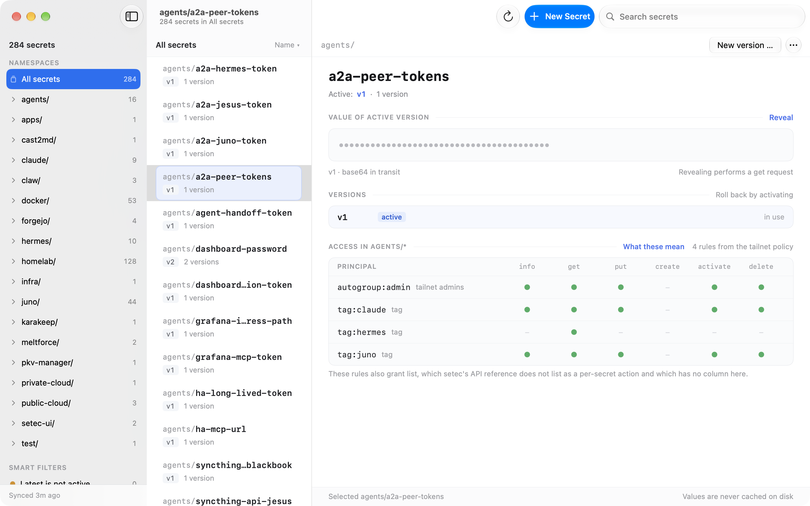

# setec-ui

A native macOS app for [setec](https://github.com/tailscale/setec), Tailscale's
secrets service, which today is driven only by the `setec` CLI. It covers the
read-and-rotate workflow: find a secret by group, filter or search, reveal and
copy its value, publish a new version, roll back by activating an older one,
delete a version or a whole secret, and see which tailnet principals hold which
grant.

The app talks to a setec server over the tailnet. Identity comes from the local
`tailscaled`, so there is no login screen and no token to enter.

<picture>
  <source media="(prefers-color-scheme: dark)" srcset="docs/screenshot-dark.png">
  <source media="(prefers-color-scheme: light)" srcset="docs/screenshot-light.png">
  
</picture>

## Download

[**Latest release**](https://github.com/meltforce/setec-ui/releases/latest) —
a signed and notarized DMG. Open it, drag **Setec UI** to Applications, and name
a setec server in Settings on first launch. macOS 26.2 or newer, universal
(Apple silicon and Intel).

Building it yourself needs none of that: `make run` for a Debug build,
`make dmg` for the same disk image the release carries.

## Layout

| Path | Holds |
|---|---|
| `design/` | The design handoff this app is built from: `handoff.md` is the specification, `api.md` the upstream API reference, `Setec Mac App.dc.html` plus `support.js` the interactive HTML prototype. A reference for look and behaviour, not code to port. |
| `App/Design/` | The handoff's token list as Swift: palette (light and dark), type scale, button styles, section header, API preview panel. |
| `App/Features/` | `SecretStore` with the list, the selection and everything derived from them; the name rules and the value generator; the access models. |
| `App/Shell/` | The window: toolbar, sidebar, list, detail with its three sections, status bar. Each column opens with a shared 38-point header, so the three start on one line. |
| `App/Sheets/` | New secret, New version, Delete secret, Delete version — all four in the same chrome. |
| `Services/` | The setec client, the tailnet policy client, the tailnet identity, the pasteboard, the logger, `DebugServer` (DEBUG builds only). |
| `Resources/` | `Info.plist` and `App.entitlements` are generated from `project.yml` by `make project` and are gitignored. |
| `project.yml` | The project definition. `*.xcodeproj` is generated from it and never committed. |
| `tools/` | `check-docs.sh`, which guards the document contract and the language rule. |
| `docs/` | The two README screenshots, one per appearance. `<picture>` in the README picks by `prefers-color-scheme`. |
| `scripts/` | `package.sh`, which builds the signed, notarized DMG. `make dmg`, `make notarize` and the release workflow all call it. |
| `.github/workflows/` | `release.yml`, the only pipeline that runs on GitHub: a `v*` tag produces the DMG and the release page. |

## What runs outside this checkout

- A setec server on the tailnet, and the Tailscale control API at
  `api.tailscale.com`. Neither is configured from here, and the app ships with
  no server built in: `SETEC_SERVER` or the Settings field names one, and Settings › Access matrix names the two setec entries
  holding the OAuth client the policy is read with — empty switches the matrix
  off and changes nothing else.
- The `tailscale` CLI, which the app runs once per launch to read the identity
  it shows in the toolbar. Without it the toolbar says "Identity unknown" and
  nothing else changes.
- `make install` copies the Release build to `/Applications/Setec UI.app`.
- The skills `mac-app-run`, `mac-app-verify` and `mac-ui-patterns` are symlinks
  in `~/.claude/skills/` pointing into `meltforce.net/mac-app-template`, and
  `~/bin/axdump` and `~/bin/winid` are built from its `tools/`. Both are
  installed by `make install-tools install-skills` in that checkout, not here.
- The build tools `xcodegen`, `swiftformat`, `swiftlint` and `xcbeautify` come
  from the homelab `dev-tools` role. Xcode comes from the App Store.

## Getting started

```bash
make run        # build Debug, launch, wait for the window
make check      # lint, build, unit tests — run this after a change
make verify     # check plus the UI tests — run this before make install
```

## Releases

Development happens on a Forgejo instance inside the tailnet, which is
canonical; `github.com/meltforce/setec-ui` is a push mirror and carries the
downloads.
Nothing originates on the mirror — a branch, tag or commit that exists only on
GitHub is removed by the next `git push --mirror` (homelab `STANDARDS.md`
§ *Git & repos*).

**Versions are dates**, `YYYY.MM.DD`, tagged with a leading `v`. A second
release on the same day adds a fourth component, `2026.09.21.2`: the app keeps
`2026.09.21` as its version — `CFBundleShortVersionString` takes three
integers and no more — and carries the counter as its build number.

A release is a tag pushed to Forgejo:

```bash
git tag -a v2026.09.21 -m "Setec UI 2026.09.21"
git push origin v2026.09.21
```

The tag reaches GitHub with the next mirror sync and starts
`.github/workflows/release.yml` on a macOS runner: build both architectures,
sign with the Developer ID of the team `project.yml` names, notarize, staple, package as a
DMG, publish the release page with the SHA-256. The tag is what sets the
version for that build, so `project.yml` does not have to be bumped first — the
value there is what a local build carries.

Every release page carries the DMG as its asset, the checksum and the
Gatekeeper assessment to compare it against; `releases/latest` always points at
the newest one, which is what the Download section above links.

The same DMG is built locally by `make dmg` (signed) and `make notarize`
(signed, notarized and stapled — needs a notarytool keychain profile named
`notary`). Both run `scripts/package.sh`, which is what the workflow runs.

To exercise the pipeline without publishing anything, dispatch the workflow by
hand: it builds and signs, leaves the DMG as a run artifact and creates no
release.

## Documents

| File | Holds |
|---|---|
| [`CLAUDE.md`](CLAUDE.md) | Conventions and gotchas for working in this repo. |
| [`ROADMAP.md`](ROADMAP.md) | Open work. |
| [`DECISIONS.md`](DECISIONS.md) | Decisions taken, with reasoning. |
| [`INCIDENTS.md`](INCIDENTS.md) | Postmortems. |
